# _Greetings! I'm Rifki Setiawan, a Game Programmer_

---

As a Multimedia Student focusing on game programming, I combine technical expertise and creativity to create mesmerizing experiences. Currently, I am a D4 Digital Multimedia Engineering student at Politeknik Negeri Jakarta, with a strong commitment in bringing innovative solutions through gaming technology.

---

## Connect with Me:

View my [**CV**](_CV-Rifki-Setiawan.pdf)

_For better viewing experience, I recommend you to download the file._

View my [**Portfolio**](https://my-web-portfolio-rifkisetiawan0101s-projects.vercel.app/)

  
  
<!--    -->
  
  
  

## Software & Language:

  <!-- Baris 1 -->
  
  <a href="#">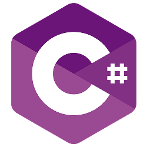</a>
  <a href="#">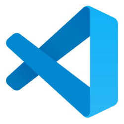</a>
  
  <a href="#">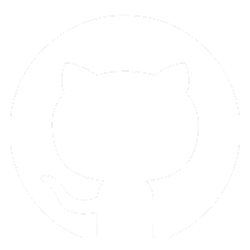</a>
  <a href="#">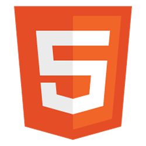</a>
  <a href="#">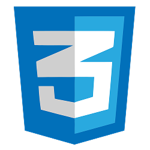</a>

  <!-- Baris 2 -->
  
  <a href="#">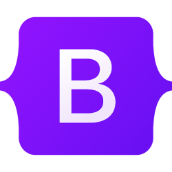</a>
  <a href="#">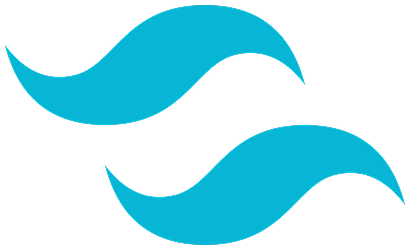</a>
  
  
  
  

  <!-- Baris 3 -->
<!--    -->
  
  
  
  
  
  
  <a href="#">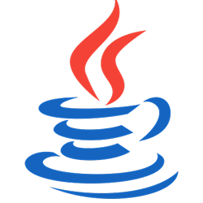</a>

  <!-- Baris 4 -->
  <a href="#">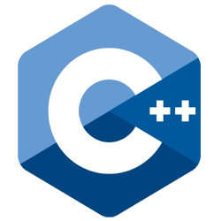</a>
  <a href="#">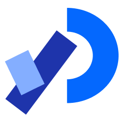</a>
  
  
  <a href="#">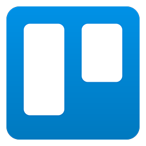</a>
  
  

## Projects:

### Game Programmer

- Working on team project ["Fondness in Riveries"](https://github.com/rifkisetiawan0101/Fondness-In-Riveries) (2025), a second project from LadaHitam Creation, which is about a mother who takes care of her son, Arell.
- Participated on team project ["Mystic Market Tycoon"](https://github.com/rifkisetiawan0101/MysticMarketTycoon) (2024), a business simulation game themed around the local vibe of Indonesia's urban ghost market.
- Participated on team project ["Cikini Ke Gondangdia"](https://github.com/rifkisetiawan0101/Cikini-Ke-Gondangdia) (2024), a casual game made with **Processing and Java** language, combines train driving simulation with parallax scrolling visuals.
- Participated on team project "Manjad" (2024), a simple yet challenging 2D platformer game made with **Construct 3**, controlling Gebol climb to the top to meet up with his friends.

  <!-- Mystic Market -->
  
  <!-- Cikini ke Gondangdia -->
  
  <!-- Manjad -->
  

### Full Stack Developer

- Develop ["Dompet Sehat Game"](https://github.com/rifkisetiawan0101/Dompet-Sehat-Game) (2025), an interactive web-based financial literacy simulation game using MERN Stack.
- Leading a website team project ["Website Damkar Depok"](https://github.com/rifkisetiawan0101/Website-Damkar-Depok) (2025), a fourth semester final project in the Web Programming course.
- ["Temporary Portfolio"](https://github.com/rifkisetiawan0101/Personal-Portfolio) (2024), a third semester final project in the Web Design course.

### Other Projects

- Leading a 3D animation team project ["The Misbrew"](https://youtu.be/KhWlnyI7htA?feature=shared) (2025), a fourth semestet final project in the 3D Animation course.
- Leading a Learning Media team project ["#JagoNgobrol"](https://youtu.be/rHxLwGc80PQ?feature=shared) (2025), a fourth semester final project in the Multimedia Authoring & Scripting course.
- Participated on team project ["Dari Ucapan, Ke Hati, dan Menjadi Rasa"](https://youtu.be/odorBME8NAI?feature=shared) (2025), a fourth semester final project in the Audio & Video Engineering course. 
